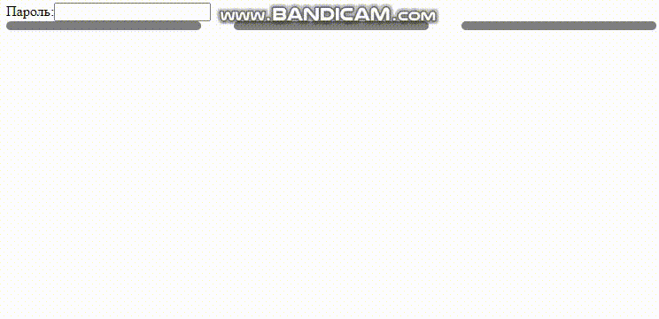

# Project "ValidationPassword"
This project is an Angular application that includes multiple components for password strength validation and a simple greeting form.

## Libraries Used
The project utilizes the following libraries:
- Angular: The Angular framework is used for building the application.
- @angular/forms: This library is used for working with forms and implementing form controls and validations.
- @angular/core/testing: This library provides testing utilities for Angular components.
- @angular/compiler/testing: This library provides testing utilities for compiling Angular components during testing.

## Password Strength Validation
The SimpleGreetingFormComponent component is responsible for password strength validation. It includes the following features:

- The component implements the ControlValueAccessor interface, which allows it to work with Angular forms and handle form control values.
- The component includes an input field for entering a password. The [(ngModel)] directive is used for two-way data binding, binding the password value to the component property.
- The component has three password strength indicators (weak, medium, and strong) represented by colored bars.
- As the user types in the password input field, the password strength is validated based on the length and complexity of the password. The strength indicators change color to reflect the password strength.
- The validatePassword() method evaluates the password and updates the indicators accordingly.
- The component uses the onChange() and onTouched() methods to communicate changes and interaction with the form control.
- The onPasswordChange() method is triggered when the password value changes, and it updates the password property and performs password validation.

## Getting Started
To run the project, follow these steps:

1. Install the necessary dependencies by running npm install in the project directory.
2. Build and run the application using ng serve command.
3. Access the application in your browser at http://localhost:4200.

Feel free to explore and modify the components and tests according to your requirements.

For more information, refer to the project's source code and documentation.
